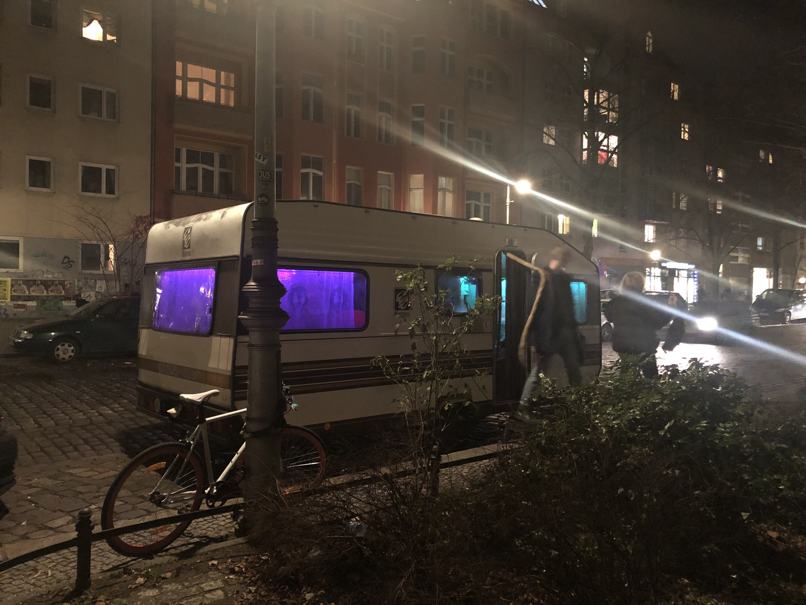
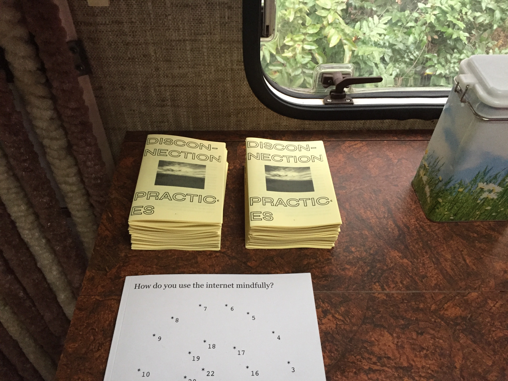
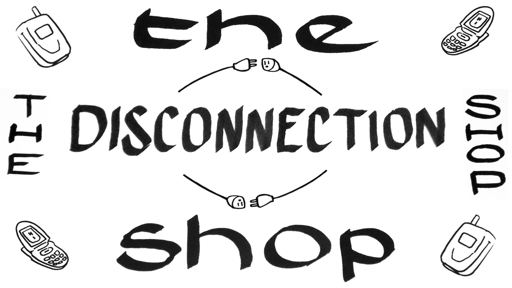

Pin Daddy made its first appearance for The Disconnection Shop, a pop-up shop of tools and practices for disconnecting from your smart-phone, that took place in Petja Ivanova's converted caravan which was parked on a street in Kreuzberg for Transmediale Vorspiel in January of 2019.

Pin Daddy is a machine that can robotically child-block your phone with a pin that you don't know so that you can't access social media. After blocking your phone, the machine prints out your unknown pin encoded into a barcode on a receipt, which you can take with you and keep in a drawer or give to a friend. In the event that you need your pin again, you can ask any unblocked smart-phone owning person to scan your barcode using a barcode scanner app which decodes your pin. 

As part of this pop-up shop, I also shared a zine of less automated Disconnection Practices (made in collaboration with Catherine Schmidt) which you can view as a PDF here: 
[disconnection-practices.pdf](https://arena-attachments.s3.amazonaws.com/3568310/9d8420005d1ff7ac32825f91553fa294.pdf?1549377955) 
or order a physical copy here --> [physical zine](http://canalswans.net/zines/disconnection-practices)

<iframe src="https://player.vimeo.com/video/315455831" width="750" height="420" frameborder="0" allow="fullscreen" allowfullscreen></iframe>
