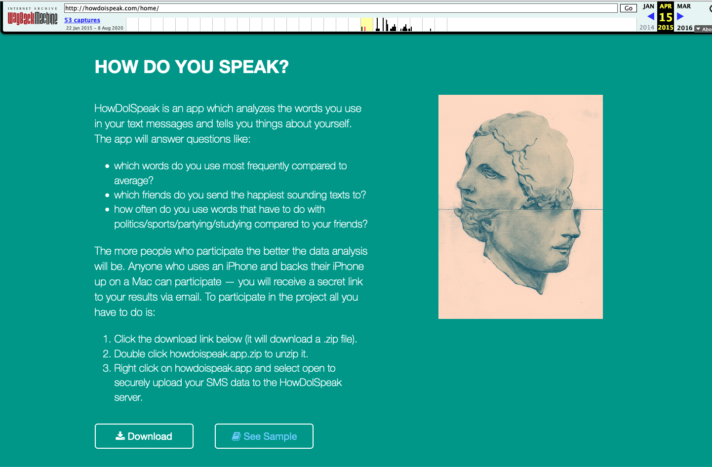
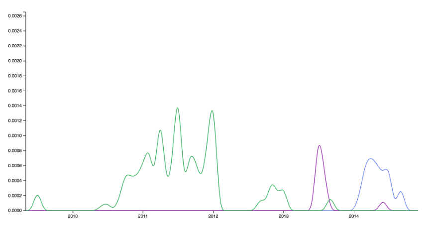

HowDoISpeak, was one of the first three creative projects that I "published" (shared to the internet), 
and which I didn't manage to fully archive (through this I learned that static HTML archives and PDFS are my favorite form of digital archive). 

This little writeup serves as a placeholder to remember and tell the story of this small project. 

HowDoISpeak was "an app which analyzes the words you use in your text messages and tells you things about yourself."

From the website you could download a script, which would upload your text messages to a server where they were analyzed, 
and then a link to view the analysis would be sent to you. Amazingly, about twenty of my friends signed up for this intimate analysis. 

Here is an incomplete archive of the site from the wayback machine:
http://web.archive.org/web/20150415224431/http://howdoispeak.com/home/

And here is an incomplete archive of the text message analysis of one of the users who may have been me.
This analysis shows words that I used abnormally frequently compared to other people who also had their text messages analyzed. 
Please note that this was over seven years ago and I honor, forgive and release that version of my ever-changing self:
http://web.archive.org/web/20170227111329/http://howdoispeak.com/abnormal/demo/

And below is a line graph showing how frequently I texted the names of three past lovers over time. 
I appreciated that the graph in some ways can convey an emotion, while in another sense saying nothing at all. 

