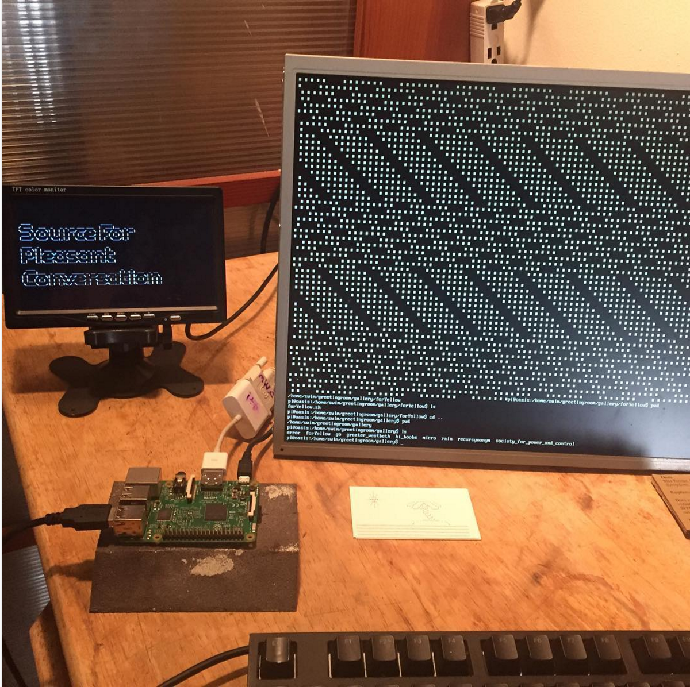

Does virtual reality need a headset?
          
Oasis is a virtual gallery for terminal and textual works contained within a raspberry pi only accessible by SSH.
You can visit <a href="http://oasisvr.info">http://oasisvr.info</a> for instructions on
how to travel to oasis (it's currently in a corner of my apartment).

Oasis was exhibited at <a href="http://radicalnetworks.org">Radical Networks</a>
and at the <a href="http://sfpc.io/classes/summer2016show/">SFPC final show</a>.

On Oasis there are folders (like any other file system), but instead of "Pictures", "Work", "Memes",
the folders on Oasis have names resembling the rooms of a house.
          
Visitors are presented with a greetingroom, as well as an attic, basement and garden (etc.) which they can move through and explore
using the command line.

The pi is publicly accessible through the internet by SSH (instructions can be found here <a href="http://oasisvr.info">oasisvr.info</a>)
so a community across the world can interact in this 'place'.
          
In July of 2016 I tweeted out a link to a site explaining how to access the pi, and around 30 people SSHed into the pi and explored,
having conversations with each other through ytalk,
and adding additional folders and files extending the imagined world.
Most of the files and folders on the pi were created by visitors.
          
I also created a gallery folder on the pi
where I collaborated with my classmates at SFPC to make terminal based art
which can be experienced through SSH (in this folder you can find 6 pieces which use terminal in different ways).

_Photos From Radical Networks_

The second photo was taken by Philippe Safire.

In the past whenever I would use SSH to work on a remote
server I noticed a feeling which resembled the presence I feel while using a Virtual Reality headset system.

With oasis I tried to take this feeling to its extreme &mdash;
maybe virtual reality doesn't need three visual dimensions.
