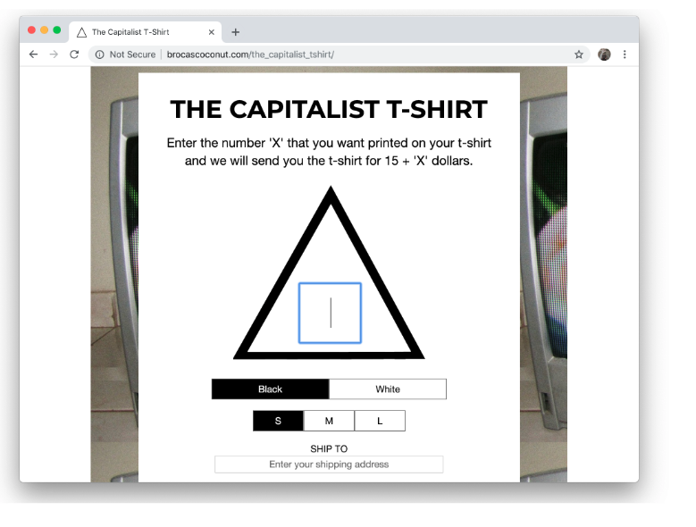
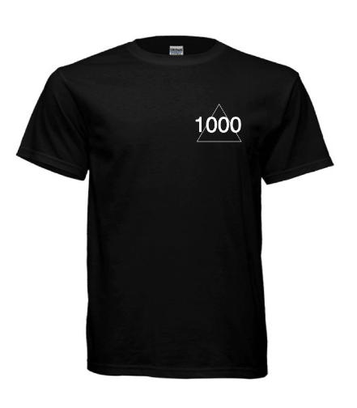

The Capitalist T-Shirt was a simple website where you can pay
to have a number printed on a
shirt, framed print, or booty shorts, showing how much you paid for it. 
The screenshot above shows what the website looked like, 
with an input form inside of a triangle where you could select a number 
(the price of the item would be the base cost of the item + this number)

I intended for the website to not
just be a commentary on other
status symbols, but also as an
inquiry into the connection
between quantification and
symbolism. At the time, small numbers like 2
and 3 seemed like interesting
choices to me — not firm anti-
capitalist choices like a 0, but
also not elaborate displays of
wealth, something in between with
unclear meaning.

Below is an image of the shirt, showing where the number would be printed into the "logo":

