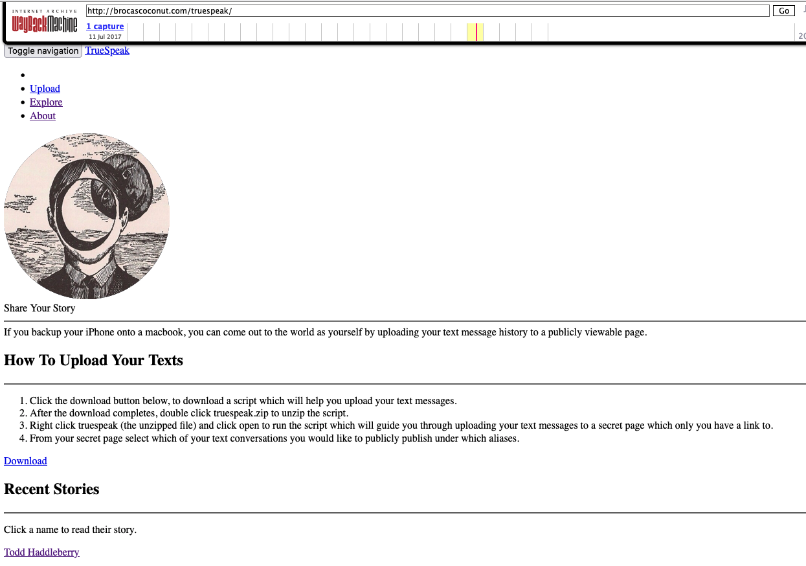

Truespeak, was one of the first three creative projects that I "published" (shared to the internet), 
and which I didn't manage to fully archive (through this I learned that static HTML archives and PDFS are my favorite form of digital archive). 

This little writeup serves as a placeholder to remember and tell the story of this small project. 

Truespeak was a website where "you can come out to the world as yourself by uploading your text message history to a publicly viewable page."

The tagline of the site says:
"If we simultaneously live one hundred incongruous lives then how can we ever hope for anyone to truly understand us. It is human to want to be understood, it is human to err, to do things that we regret, to forgive, and to share our stories."

I didn't really expect anyone to upload their text messages (which no one did), 
but I liked the thought experiment. 

Here is an incomplete archive of the site from the wayback machine:
<a href="http://web.archive.org/web/20170711175421/brocascoconut.com/truespeak/">http://web.archive.org/web/20170711175421/brocascoconut.com/truespeak/</a>

