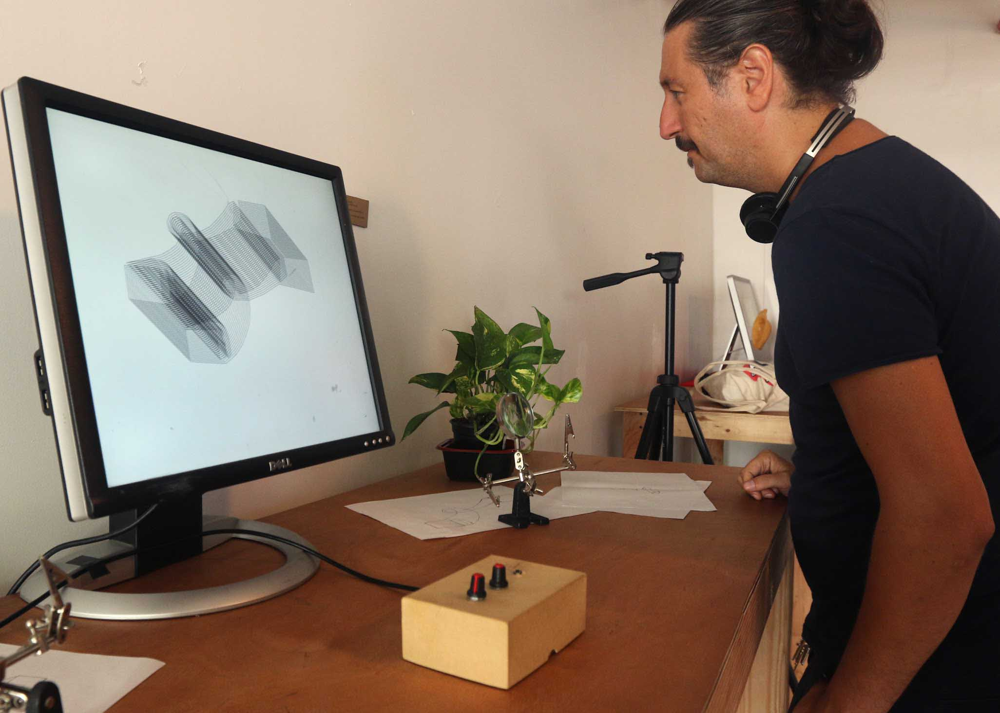
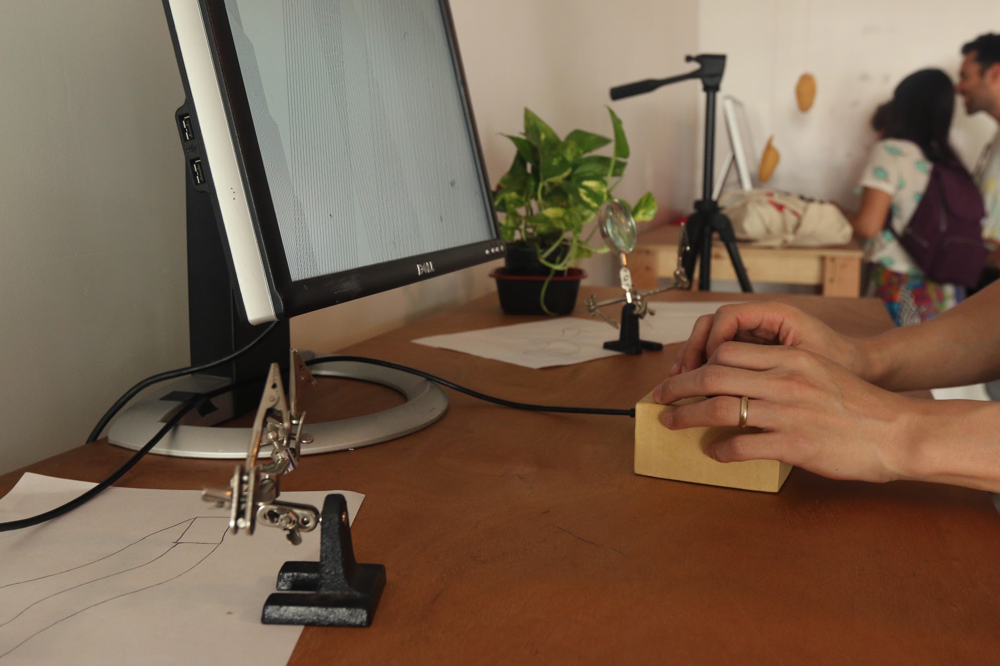
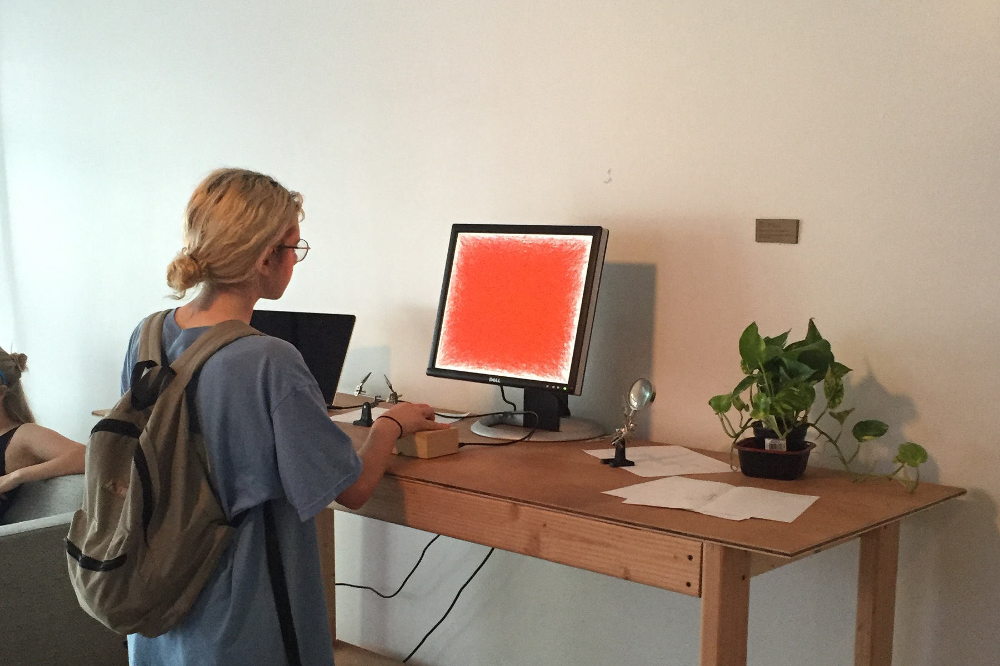
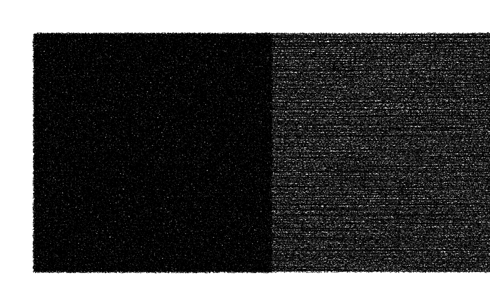
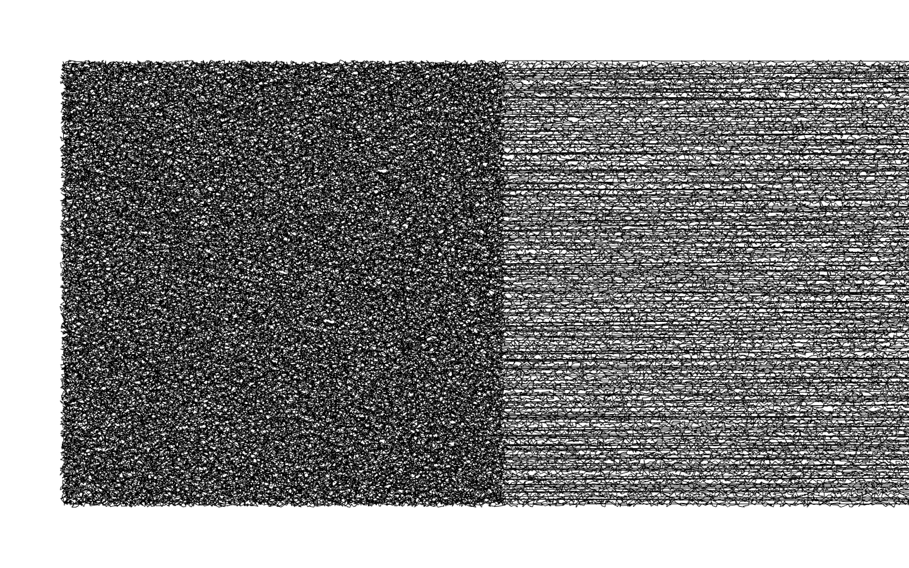
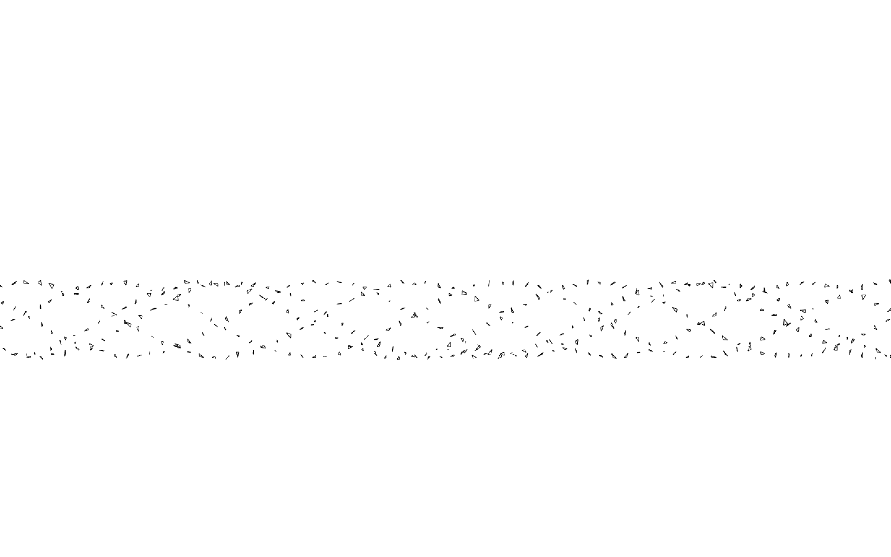
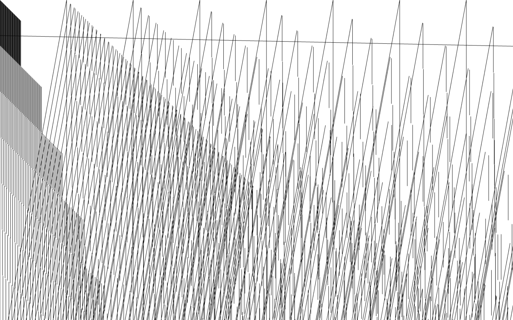
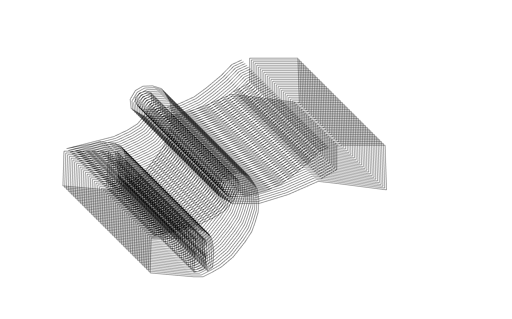

Using a handmade cardboard interface housing an arduino and 2 potentiometers (2 pots), visitors control parameters
of a series of generative line drawings made using open frameworks.
          
_2 pots_ was an installation created for the <a href="http://sfpc.io">SFPC</a> final show at the end of
a 10 week session in 2016.

   

Below are a series of screenshots taken directly from openframeworks:

    
You can also see one sketch which was ported over to the browser using p5.js <a href="http://mhfowler.github.io/westbeth-processing/sketches/veragrowth/vera.html">here</a>.
