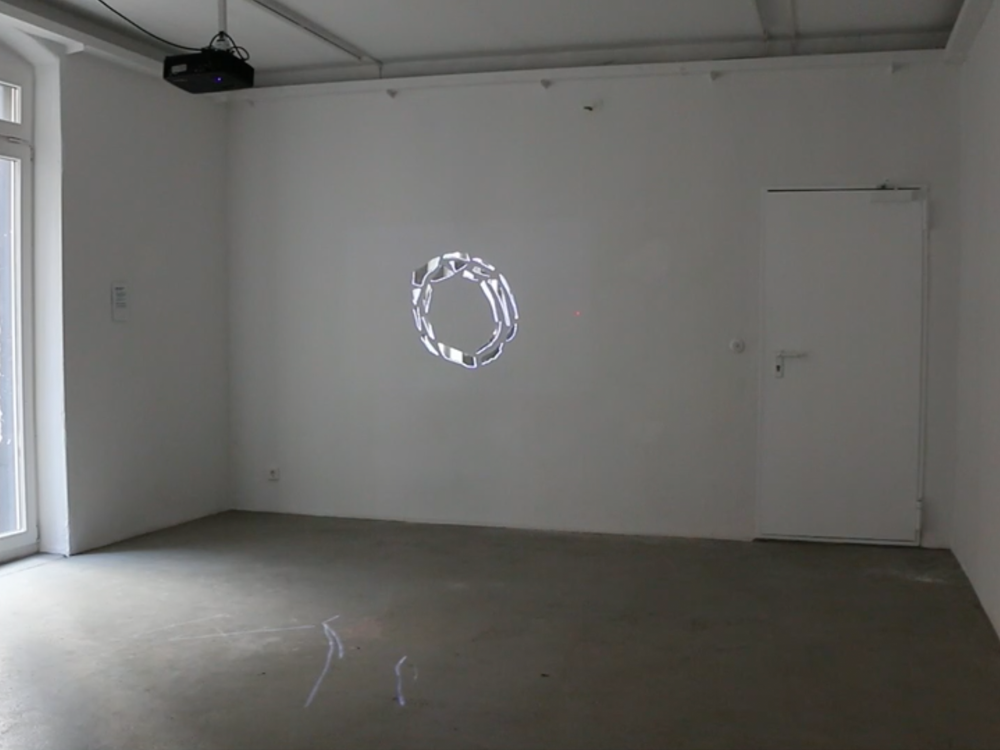
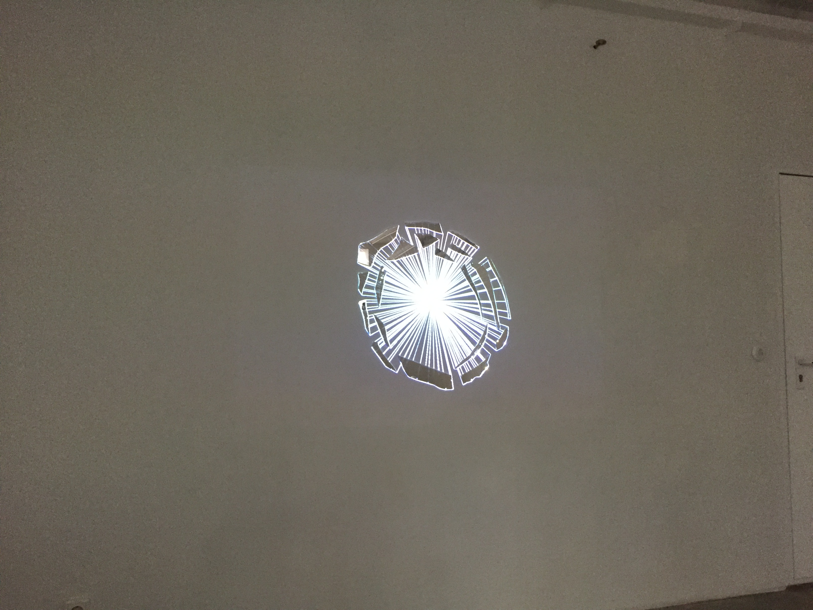

<iframe src="https://player.vimeo.com/video/227833557?autoplay=1" width="750" height="422" frameborder="0" webkitallowfullscreen mozallowfullscreen allowfullscreen></iframe>

  

_Looking Glass_ was exhibited at <a href="http://acudmachtneu.de/">Acud Macht Neue</a> for a School Of Machines community show.

3 minutes of animations I made using openframeworks were projected onto a broken mirror using the vector shapes of the broken mirror as input to the animations.

 

